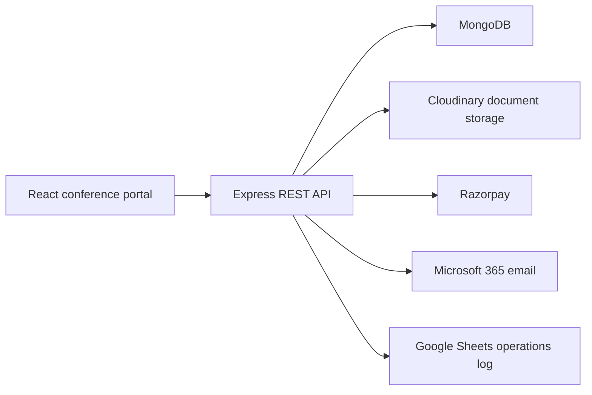

# STIS-V 2025 Conference Platform

[](https://github.com/VishwasPrabhakara/STISV_Server/actions/workflows/ci.yml)

Production full-stack platform built for the **Fifth International Conference
on the Science and Technology of Ironmaking and Steelmaking (STIS-V)**, hosted
by the Department of Materials Engineering at the Indian Institute of Science,
Bengaluru, from December 9-12, 2025.

**Live post-event site:** [materials.iisc.ac.in/stis2025](https://materials.iisc.ac.in/stis2025/)

> The public site now serves as a conference archive with the programme,
> proceedings, speakers, sponsors, venue information, and event media. The
> repository also documents the protected workflows used during the event.

## What Was Built

| Area | Capability |
|---|---|
| Public website | Responsive conference pages, announcements, programme, speakers, sponsors, travel and venue information |
| Participant accounts | Registration, login, profile management and expiring password-reset links |
| Abstract workflow | Document upload, multiple submissions per author, status tracking, finalization and organizer review |
| Registration workflow | Multi-step delegate details, category selection and student-document upload |
| Payments | Razorpay order flow, signed payment verification, webhook processing, bank-receipt upload and receipt generation |
| Administration | Role-protected abstract review dashboard and status updates |
| Operations | MongoDB persistence, Cloudinary uploads, transactional email and Google Sheets synchronization |

## Engineering Highlights

- Route-level JWT authentication with resource ownership checks
- Separate administrator authorization for participant-data exports
- Server-side registration-fee calculation and Razorpay HMAC verification
- Origin allowlisting for credentialed cross-origin requests
- Time-limited, single-use password reset tokens
- MIME and upload-size restrictions for conference documents
- Environment-based frontend and backend configuration
- Automated frontend build and backend security tests in GitHub Actions

## Architecture



## Technology

**Frontend:** React 18, React Router, Axios, Bootstrap, jsPDF

**Backend:** Node.js, Express, MongoDB/Mongoose, JWT, bcrypt, Multer

**Integrations:** Razorpay, Cloudinary, Nodemailer, Google Sheets

**Delivery:** IISc web infrastructure, Render API deployment, GitHub Actions

## Repository Layout

```text
.
|-- public/                 Static conference assets
|-- src/
|   |-- components/         Public pages and participant/admin workflows
|   `-- config/             Browser-safe runtime configuration
|-- server/
|   |-- config/             CORS and external-service configuration
|   |-- controllers/        Integration logic
|   |-- middleware/         Authentication and authorization
|   |-- tests/              Backend security-focused tests
|   |-- utils/              Signature verification helpers
|   `-- server.js           Express application and conference routes
|-- .github/workflows/      Continuous integration
`-- SECURITY.md
```

## Run Locally

Requirements: Node.js 20+ and MongoDB.

```powershell
git clone https://github.com/VishwasPrabhakara/STISV_Server.git
cd STISV_Server
npm ci
Copy-Item .env.example .env

cd server
npm ci
Copy-Item .env.example .env
npm start
```

In a second terminal:

```powershell
cd STISV_Server
npm start
```

The frontend runs at `http://localhost:3000` and the API at
`http://localhost:5000`. External integrations require your own development
credentials; no production secrets or participant data are included.

## Verification

```powershell
npm run build
cd server
npm test
```

Backend tests cover JWT enforcement, administrator role checks, ownership
isolation, and timing-safe HMAC validation.

## Privacy and Scope

This is a source-code showcase. Participant records, payment details,
organizer credentials, private service-account files, and operational exports
are intentionally excluded. See [SECURITY.md](SECURITY.md) for responsible
disclosure guidance.

## Contribution

**Vishwas Prabhakara** contributed to the full-stack implementation, backend
integrations, deployment, and production support for the live conference
platform. The live site credits Vishwas Prabhakara, Kumar Harsh, and Swaraj
Kumar for design and development.

- [GitHub](https://github.com/VishwasPrabhakara)
- [LinkedIn](https://www.linkedin.com/in/vishwas-prabhakara-2050821b6/)

## Usage

Built for the STIS-V 2025 organizing committee at the Indian Institute of
Science. Conference content and branding remain the property of their
respective owners.
